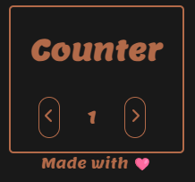

  
  <h2>Notion Widgets</h2>

### 🚨Description:

In this repository you'll find a several of widgets.

It's all in one place, because it's deployed in github pages.
You'll find a description beyond the file names.

 
<h4 align="center">📍 READING-COUNTER.HTML</h4>

    

##### 🚨How it works.
If you want to use directly in notion, you'll do a embeded link and insert the url of the counter that I have shared with you.
I have deployed in github pages.

If you don't like the colour you can fork this repository, make the changes and deploy on your own.

##### Description:

It's the first widget I ever programmed.

In this little project, I have learned how to do JS Local Storage, so when you set a number and close the tab this number don't reset.
**(It might be a problem if you clean the cache, because it is stored locally in the browser and not in a database(this is a problem for future me).**

I have also learned how to do mousedown, mouseup, this way, you don't have to set a number clicking one by one. If you press the button the numbers go to infinite and beyound and stop when you literally mouse up.
With this, I have also discovered that mouseup don't work in mobiles, so I've also learned touchstart and touchend.

 
<h4 align="center">📍 GREETING.HTML</h4>

I get it from https://blog.shorouk.dev/notion-widgets-gallery/notion-widget-minimal-greetings/
 
Made a colour change and deployed at github pages:
https://aleehsophia.github.io/notion_widgets/greeting.html

 
<h4 align="center">📍 MONTH-TIME.HTML</h4>
I get it from https://blog.shorouk.dev/notion-widgets-gallery/notion-widget-minimal-time-left-in-month/
 
Made a colour change and deployed at github pages:
https://aleehsophia.github.io/notion_widgets/month-time.html